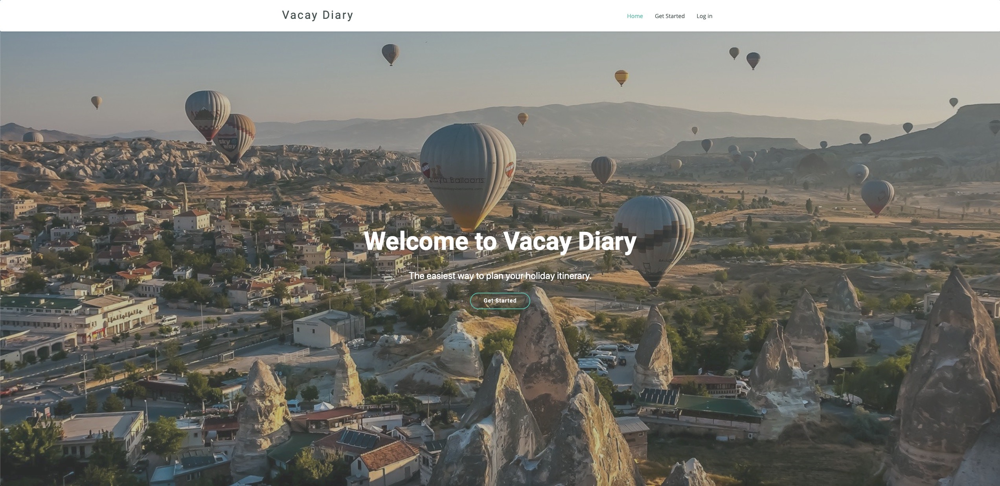
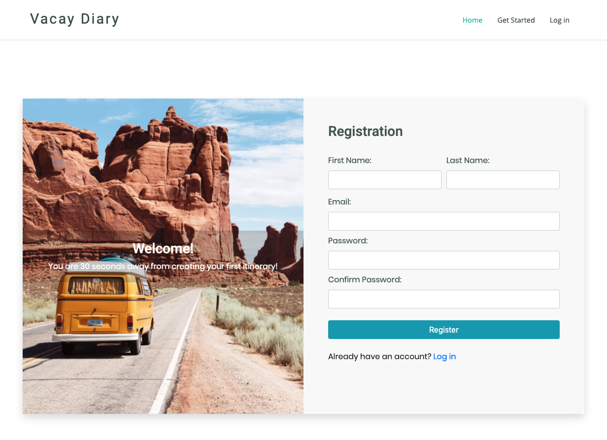
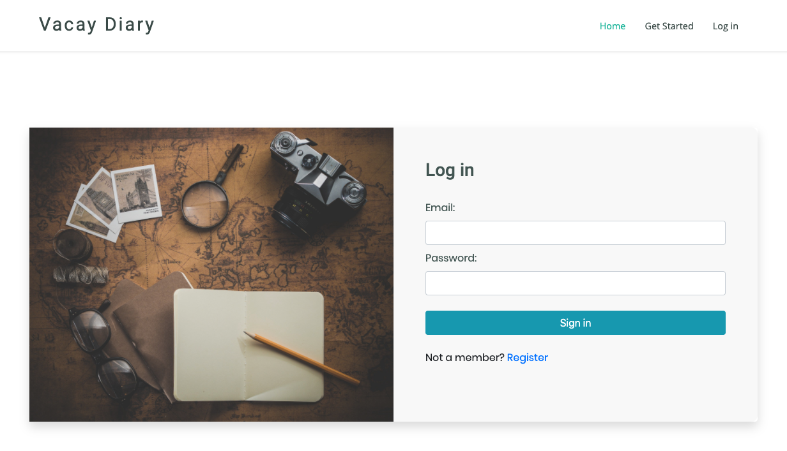
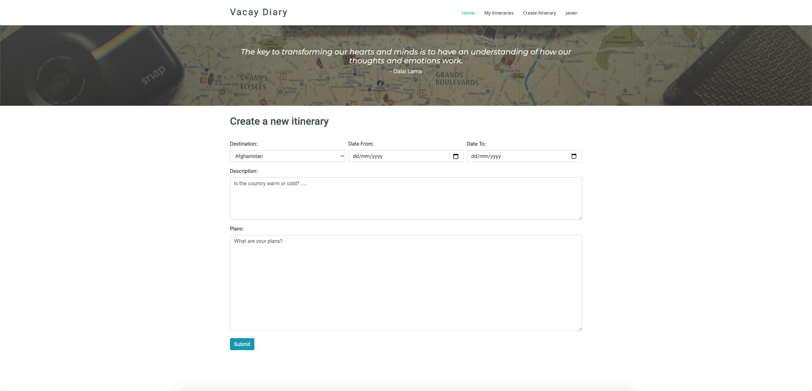
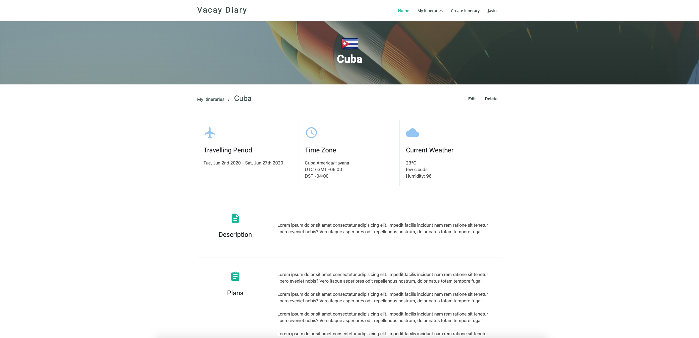
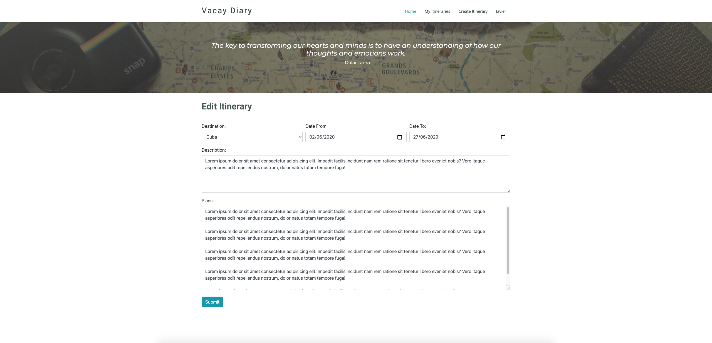
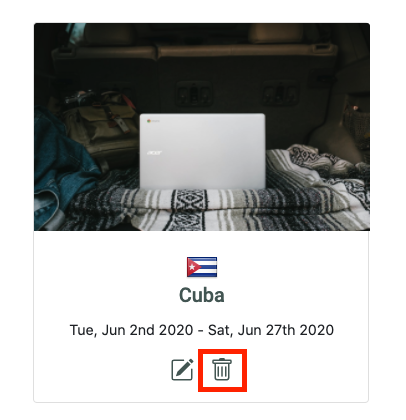
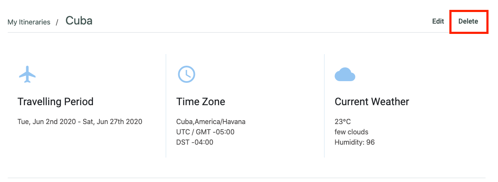
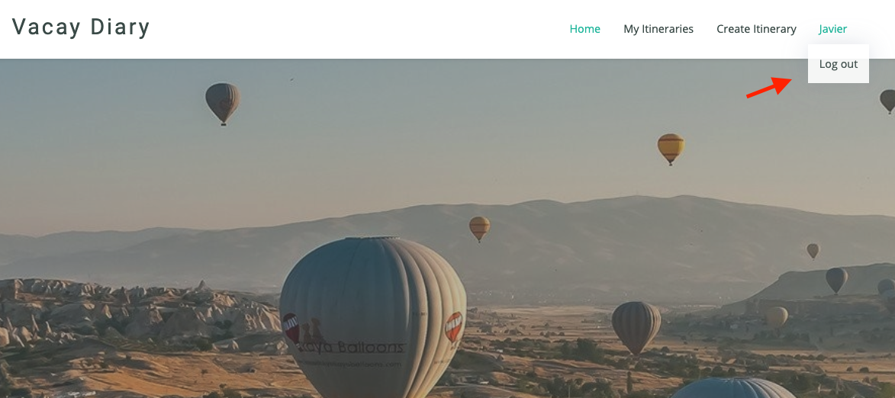

# Vacay Diary
An app to plan and manage holiday itineraries. Create an itinerary in Vacay Diary whenever you are travelling overseas and all your itineraries will be stored in one place. 

## Table of Contents
 - [Application Link](#application-link)
 - [Application MVP](#application-mvp)
 - [Dependencies](#dependencies)
 - [Difficulties Faced](#difficulties-faced)
 - [Wireframes and User Stories](#wireframes-and-user-stories)
 - [RESTful Routes](#restful-routes)

## Application Link
**Vacay Diary** is available to try on [https://vacay-diary.herokuapp.com](https://vacay-diary.herokuapp.com)

## Application MVP
 - A working full-stack application using **Node.js**, **MongoDB**, **Express** and **EJS**
 - Adhered to MVC file structure: **Models**, **Views**, **Controllers**
 - Included all 7 **RESTful routes** and full **CRUD** application
 - Deployed online and accessible to the public via **Heroku**

## Dependencies
 - **Bcrypt** is used to hash and store passwords
 - **Bootstrap** is used for front-end framework containing HTML and CSS based design templates
 - **Connect-flash** is used for storing and displaying messages, which was used in combination with redirects
 - **Countries-and-timezones** library to work with countries and timezones data
 - **Dotenv** is used as a zero-dependency module that loads environment variables from a *.env* file into *process.env*.
 - **EJS** is used as the templating engine and allows generating HTML with plain javascript
 - **Express-session** is used to store user state and every user will be assigned a unique session
 - **Method-override** to allow us to use HTTP verbs such as PUT and DELETE in places where the client doesn't support it
 - **Moment.js** is used as a wrapper for the native JavaScript Date object
 - **Mongoose** is used as a schema-based solution to model the application data. It manages relationships between data, provides schema validation, and is used to translate between object in code and the representation of those objects in MongoDB
 - **Node-fetch** is used to fetch resources and making API requests
 - **Node-geocoder** is used to get geolocation for countries
 - **Passport.js** is used to authenticate username and password
 - **SweetAlert** is used as a replacement for JavaScript's popup boxes (modals)
 - **Unsplash-js** is used as a server-side Javascript wrapper for working with [Unsplash API](https://unsplash.com/developers) to retrieve photos

## Difficulties Faced
 1. **Could not get Moment Timezone to work**
 > Tried to use Moment Timezone to display the current time of the country, however could not get it to work.
 2. **Mongoose Schema**
 > Problem getting data saved into MongoDB using Mongoose schema initially. Turns out that if you already have a collection in MongoDB, the schema model function needs to match with the existing collection name on the 3rd parameter.

## Wireframes and User Stories
### 1. Home Page
As a user, I want to know what this application is about when I access the website at a glance.

### 2. Registration Page
As a user, I want to be able to register a new account.

### 3. Login Page
As a user, I want to be able to login to the application.

### 4. Create Itinerary Page
As a user, I want to be able to create a new itinerary.

### 5. My Itineraries Page
As a user, I want to be able to view all of my itineraries that I created.

### 6. Show Page
As a user, I want to be able to view individual itinerary in details.

### 7. Edit Page
As a user, I want to be able to edit my itineraries.

### 8. Delete Itinerary
As a user, I want to be able to delete my itineraries.

 

### 9. Log Out
As a user, I want to be able to log out.

## RESTful Routes
### Application routes
| NAME        | PATH                              | HTTP VERB  | PURPOSE
| ----------- |:----------------------------------| :---------:| :--------
| Index       | /                                 | GET        | Home page
|             | /app                              | GET        | Home page after user logged in
|             | /app/my-itineraries               | GET        | Display all itineraries by user
| New         | /app/new                          | GET        | Shows new form for new itinerary entry
| Create      | /app/my-itineraries               | POST       | Creates a new itinerary
| Show        | /app/my-itineraries/:id           | GET        | Shows one particular itinerary
| Edit        | /app/my-itineraries/edit/:id      | GET        | Shows edit form for a particular itinerary
| Update      | /app/my-itineraries/edit/:id      | PUT        | Updates a particular itinerary
| Destroy     | /app/my-itineraries/:id           | DELETE     | Deletes a particular itinerary

### User routes
| NAME        | PATH                              | HTTP VERB  | PURPOSE
| ----------- |:----------------------------------| :---------:| :--------
| New         | /register                         | GET        | Shows registration form for user to register
|             | /login                            | GET        | Shows login form for user to login
|             | /logout                           | GET        | Log user out and terminate a login session
| Create      | /register                         | POST       | Creates a new user upon successful registration
|             | /login                            | POST       | Login user upon successful authentication
